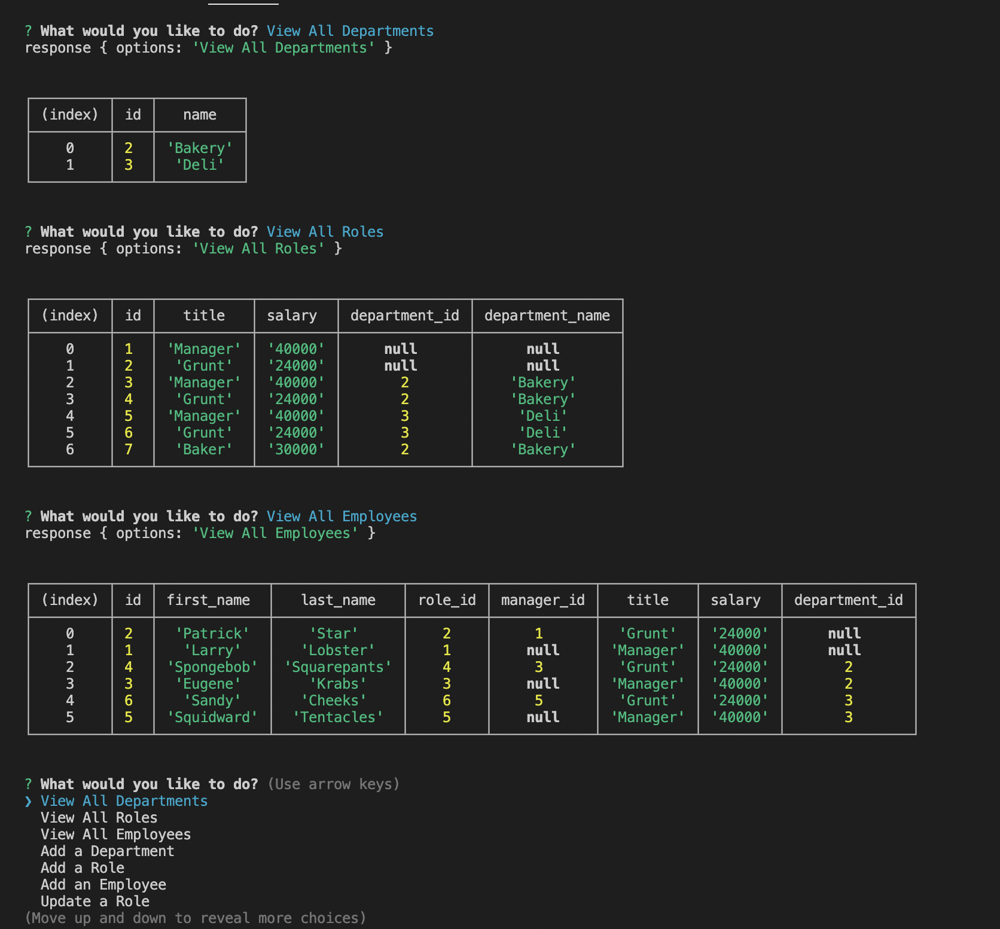

# Challenge #6 - Weather Dashboard

## Description

    This project was about using MySQL to create a database of company info (departments, role, & employees) that that could be manipulated and altered with user input. After the user runs the program within the terminal, it will prompt a list of options. When selected, the user will be prompted questions pertaining to the selected action and the program will alter the database info accordingly. 

## Experience Gained

    Creating our own data to work with was a new experience that allowed insight into how a program could store various related information on practically anything. The most challenging aspect of building this program revolved around the particular syntax that was required by MySQL and swapping between the queries to the database and regular js notation. In fact, the add employees function and the update role function were two pieces that I could not get to update the database in the end when I ran out of time. The syntax looks correct, but I'm missing something, so I need to review them again. I also built a few of the bonus parts of the challenge, specifically the Delete sections.

## GitHub Links (Repository and Demo Video)

    The repository link: https://github.com/ekball/C12-Employee-Tracker

    The demo video link: 

## Demo README

